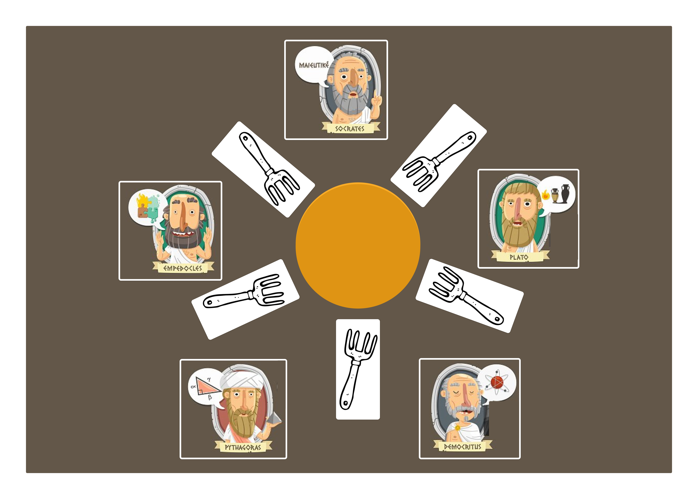
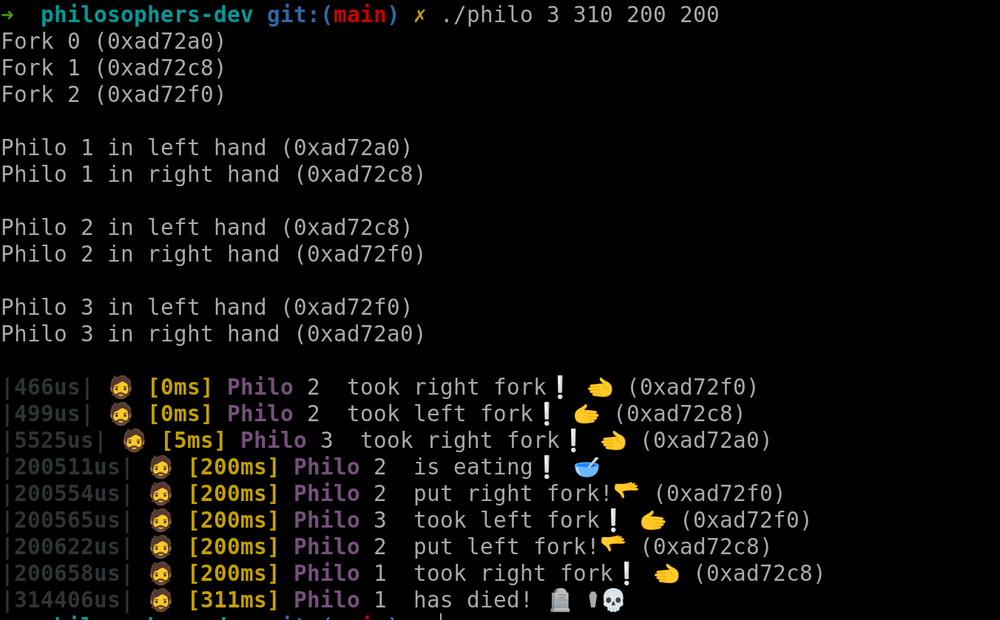

# 42_philosophers

Philosophers is a 42 proyect that aims to teach us on multithreading programing and concurrency.

For this, we need to implement the problem of the Dinning Philosphers. The subject tell us that we need to
recreate a situation where there is a given number of philosphers around a table that can do one of three actions
each time:
- Eating
- Sleeping
- Thinking

In the middle of the table there is a big bowl of spaghetti, each philo has one fork, but they need
two to be able to eat. Therefore, they need to use the fork of their sitting neighbours. 

## Requirements
Here are the things you need to know if you want to succeed this assignment:
- One or more philosophers sit at a round table.
There is a large bowl of spaghetti in the middle of the table.
- The philosophers alternatively eat, think, or sleep.
While they are eating, they are not thinking nor sleeping;
while thinking, they are not eating nor sleeping;
and, of course, while sleeping, they are not eating nor thinking.
- There are also forks on the table. There are as many forks as philosophers.
- Because serving and eating spaghetti with only one fork is very inconvenient, a
philosopher takes their right and their left forks to eat, one in each hand.
- When a philosopher has nished eating, they put their forks back on the table and
start sleeping. Once awake, they start thinking again. The simulation stops when
a philosopher dies of starvation.
- Every philosopher needs to eat and should never starve.
- Philosophers don’t speak with each other.
- Philosophers don’t know if another philosopher is about to die.
- No need to say that philosophers should avoid dying!

## Technologies
### Languajes
- c 99% 
- Make 1%
### Compiler & Platform
- cc
- x86-64
- Tested on Linux
